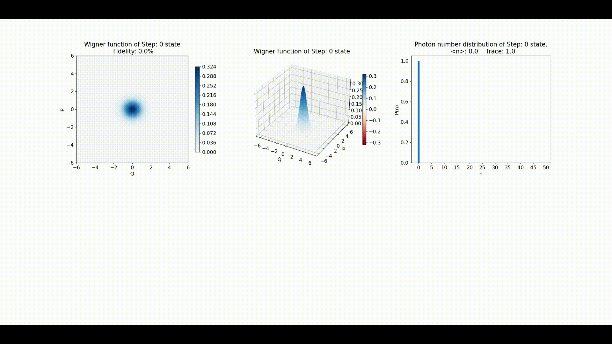

# Deep reinforcement learning for quantum state engineering of squeezed cat and cubic phase states 

This is the supporting code for the results presented in the paper I co-authored *Machine learning for efficient generation of universal hybrid quantum computing resources* available [**here**](https://arxiv.org/abs/2310.03130)
